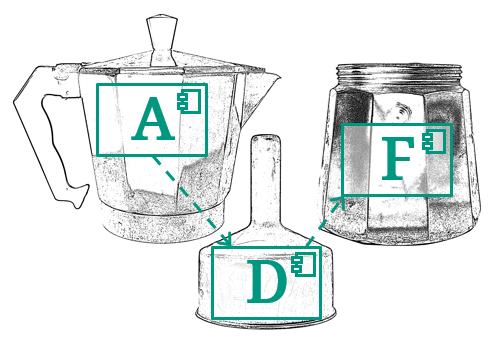

# Architecture Decomposition Framework <!-- omit in toc -->

**Welcome!** **Good you made it here!** This is the entry point for learning more about the **Architecture Decomposition Framework (ADF)**, an architecture view framework invented at [Fraunhofer IESE](https://www.iese.fraunhofer.de/en/services/software-architecture.html), suitable for all software systems and usable freely by everyone.

## Getting started

- Our [FAQs](faqs/FAQs.md)
- A article about the ADF in the IESE Blog
  - [Designing software architectures more easily and documenting them more clearly with the Fraunhofer ADF](https://www-iese-fraunhofer-de.translate.goog/blog/softwarearchitekturen-einfacher-designen-und-verstaendlicher-dokumentieren-mit-dem-fraunhofer-adf/?_x_tr_sl=de&_x_tr_tl=en&_x_tr_hl=en) (machine-translated to English)
  - [Softwarearchitekturen einfacher designen und verständlicher dokumentieren mit dem Fraunhofer ADF](https://www.iese.fraunhofer.de/blog/softwarearchitekturen-einfacher-designen-und-verstaendlicher-dokumentieren-mit-dem-fraunhofer-adf/) (German original version)
- [Webinar Architekturdokumentation mit dem ADF](https://www.youtube.com/watch?v=xhZAF2jE4Ak) (in German)

## Reference guides

- [Architecture Design with the Architecture Decomposition Framework (ADF)](adf-design/Design.md), introducing the ADF architecture design process that can help experienced and less experienced software architects with architecture design
- [Dimensions and view types](adf-dimensions/Dimensions.md), an explanation of the different views we use to describe a system.
- [ADF elements and relations per view type](adf-elements/ADF-elements.md), a reference of (mostly) UML elements and relations and their meaning in the context of the ADF.
- [ADF architecture documentation template](https://github.com/architecture-decomposition-framework/adf-documentation-template), a ready-to-get-started architecture documentation template including instructions how to use it.

## Examples

- [An example documentation using ADF and the documentation template](https://github.com/neshanjo/what2eat/blob/with-cache/doc/architecture-documentation.md)

## Tools

- [ADF tool libraries for diagrams.net (formerly known as draw.io)](https://github.com/architecture-decomposition-framework/adf-diagramsnet), so that you can create ADF diagrams easily in [Diagrams.net](https://www.diagrams.net/).
- [ADF elements predefined for PlantUML](https://github.com/architecture-decomposition-framework/adf-plantuml), allowing you to create ADF diagrams using [PlantUML](https://plantuml.com/).
- [ADF Documentation-as-code](adf-doc-as-code/Doc-as-code.md), a suggested toolchain for a light-weight, low-barrier entry into architecture documentation as close to the source code as possible, using Markdown, Diagrams.net, GitLab/GitHub (or any other Git server capable of rendering Markdown), VS Code plus Plugins (or any other IDE with Markdown support) and Marp (for presentations - optional)

## Further resources

- [Dominik's huge collection of resources on software architecture](https://github.com/domrost/software-architecture-resources)

## Footnote

This page was written by Johannes Schneider. You can use all material freely under the [CC BY-SA 4.0 license](https://creativecommons.org/licenses/by-sa/4.0/).
