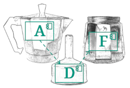

# Architecture Design with the Architecture Decomposition Framework (ADF) <!-- omit in toc -->

Version 1.0.0

This article gives some basic introduction and advice on architecture design and explains the ADF architecture design process.

## Content <!-- omit in toc -->

- [Introduction](#introduction)
- [Architecture design process overview](#architecture-design-process-overview)
- [Runtime first](#runtime-first)
- [System-context delineation](#system-context-delineation)
- [System decomposition](#system-decomposition)
  - [Hierarchical functional decomposition](#hierarchical-functional-decomposition)
  - [Data-driven decomposition](#data-driven-decomposition)
  - [Dynamic system description](#dynamic-system-description)
  - [Deployment-driven decomposition](#deployment-driven-decomposition)
  - [Runtime technology selection](#runtime-technology-selection)
- [Quality attributes at runtime](#quality-attributes-at-runtime)
- [Mapping runtime to devtime and devtime decomposition](#mapping-runtime-to-devtime-and-devtime-decomposition)
  - [Mapping runtime to devtime](#mapping-runtime-to-devtime)
  - [Devtime decomposition](#devtime-decomposition)
- [Devtime quality attributes](#devtime-quality-attributes)
- [Summary](#summary)
- [Footnote](#footnote)

## Introduction

For designing a system with an adequate software architecture, mainly three things are needed:

1. Experience
2. Experience
3. Experience

And, of course, some creativity to apply your experience to new situations.

While you can teach yourself how to document your design in a comprehensible way (e.g. by using the ADF and the [ADF documentation template](https://github.com/architecture-decomposition-framework/adf-documentation-template)), there is no shortcut to gaining experience. You have to get to work on a variety of different systems in order to be an experienced software architect. Additionally, software systems can vary a lot. A software architecture suitable for one system can be completely inappropriate for another system.

With all this in mind, we won't (and can't) give any concrete advice in this document. So don't expect us saying e.g. "use microservices, that's currently the best architecture pattern", "use typescript for client development, that's the best technology" or "your main system should always consist of two or three subsystems".

However, we know from practice that many software development projects do not explicitly assign the role of the software architect. It's often the lead developer's job to make decisions on the software architecture. Most of these decisions are implicit and undocumented (i.e. other than through the source code of the project).

In this document, we describe a generic architecture design process, which targets both

1. *software developers and unexperienced architects* that do not know how to start with software architecting by offering ideas on how to look at the system as a whole and decomposing it into manageable parts *before* starting to code, and
2. *experienced software architects* to optimize their strategy of how to design a system while also keeping track on the desired quality attributes.

## Architecture design process overview

Architecture design requires many different activities. Our design process gives names to these activities and proposes an order that helps to focus on the end-result - an adequate (running) system that fulfills all requirements and quality attributes (i.e. the architecture drivers). This is the complete process visualized:

In the following sections, we shall explain the different activities (blue boxes in the middle of the figure) in greater detail. Note, however, that despite the linear connection of the activities the whole process is not meant to be executed exactly once in linear order, but many iterations and subiterations are foreseen (indicated by the arrows on the left side of the figure).

The left side (in red) shows what should be considered as input for every step, while the right side depicts the corresponding architecture documentation artifact that is generated or updated in each step. These artifacts need to be consistent ("Consolidate"). Finally, every new design increment should be viable within the system, which can be e.g. be tested with the help of prototypes ("Increase Confidence").

## Runtime first

While developers like to minimize the time between ideas (requirements) and first lines of code, software architects should first understand the big picture including the most important requirements and quality attributes of the system. To this purpose, it is much more helpful to imagine the system already existing and then set up the development accordingly than the other way around. Hence, the following chapters first deal with the system at runtime.

## System-context delineation

We start by identifying roles of users interacting with the system and set the scope of the system under development (can be one or several systems in a black-box view). Then, we specify, how the roles interact with the system: What do they want to achieve?

Additionally, we identify all external systems that are needed and provided. What are they needed for? Is it the external system connecting to the system under development or the other way around? Or both?

The result of the context-delineation can be shown with elements of the [Software@Runtime palette](../adf-elements/ADF-elements.md#softwareruntime) and belong to the Dimension [Function@Runtime](../adf-dimensions/Dimensions.md#functionruntime).

This is an unspecific example of how such a diagram can look like. Of course, the actual number of elements and the way, in which the elements are connected, strongly depends on the actual system.

## System decomposition

In this part of the article, we describe how to decompose a system into smaller, manageable parts. The different decomposition strategies have no particular order and can even result into incompatible architectural structures when executed independently. So you might not need all of them. However, when you do not already know from the beginning that your architecture should be driven by a certain aspect (e.g. by data), we recommend to try all the different decomposition strategies. Then you choose the most suitable one or combine ideas from all of them.

### Hierarchical functional decomposition

Usually, a system must serve different functionalities, e.g. authenticating a customer, displaying items to buy, putting items into a shopping cart, making payments, and so on.

This decomposition strategy breaks down the systems into smaller, functional parts. If you are designing more than one system, do this for each system.

The result of the functional decomposition can be shown with elements of the [Software@Runtime palette](../adf-elements/ADF-elements.md#softwareruntime) and belong to the Dimension [Function@Runtime](../adf-dimensions/Dimensions.md#functionruntime).

This is an unspecific example of how such a diagram can look like. Of course, the actual number of elements and the way, in which the elements are connected, strongly depends on the actual system.

Often, functional decomposition is hierarchical, where components are recursively divided into sub-components and even sub-sub-components, e.g.

- the System is divided into
  - Component 1, which is divided into
    - Component 1a, and
    - Component 1b
  - Component 2, which is divided into
    - Component 2a,
    - Component 2b,
    - Component 2c, which is divided into
      - Component 2c1, and
      - Component 2c2
    - Component 2d, which is divided into
  - Component 3, which is divided into
    - Component 3a,
    - Component 3b, and
    - Component 3c,
  - ...

This can be documented by diagrams that show a detailed decomposition of certain components like this (unspecific) example:

For the sake of clarity, it is not recommended to show all subcomponents in one single diagram.

### Data-driven decomposition

Software-Engineers are trained to develop sophisticated data models and express them in UML class diagrams or SQL table description. While these models are crucial during development, we recommend to first take a step back and look at the whole system at **runtime**: Which different data is there in the system? Can different domains be identified? A web shop, for instance, has user data, article data, shopping cart data and payment data. Once the main data entities are identified, they can be refined further, e.g. by splitting up or adding attributes. Note that, in this first step, it is not about inheritance or data types, but the general structure of the data.

The result of the data-driven decomposition can be shown with elements of the [Software@Runtime palette](../adf-elements/ADF-elements.md#softwareruntime) and belong to the Dimension [Data@Runtime](../adf-dimensions/Dimensions.md#dataruntime).

This is an unspecific example of how a diagram with the main data entities can look like. Of course, the actual entities strongly depend on the actual system.

Note that this step can have major influence on the functional decomposition. Data usually does not exist on its own, but is created and sent through the system. Thus, it makes sense to connect functional and data views, e.g. by indicating data flow between components. A common approach in modern software design is the so called Domain Driven Design where the different domains (and their data models) drive the structure of the whole system. [Welcome to DDD](https://github.com/ddd-crew/welcome-to-ddd) by the DDD crew is a good starting point to learn more.

### Dynamic system description

The more complex the component structure of a system is, the less obvious it seems how, in which way and, particularly, in which order the components interact with each other. There are different ways to describe these aspects. Of course, this step only makes sense when you have already identified some components.

It might be as simple as consecutively numbering the relations and describing what happens in each step. Here is an unspecific example of how a diagram describing the handling of one particular request can look like:

However, this illustration can easily become convoluted when also describing error cases or other requests, so several diagrams in a more linear form can be helpful. Here is the latter unspecific example again, but written as an [UML sequence diagram](https://en.wikipedia.org/wiki/Sequence_diagram):

Note that the ADF does not introduce any particular notation for sequence diagrams - feel free to use the one you are familiar with (or just use UML).

### Deployment-driven decomposition

To address deployment, we consider how the different functionalities of the system are brought to execution. Many different deployment types are imaginable: Client (desktop) deployment, server deployment, two-tier or multi-tier client-server topologies, peer-to-peer networks, monolithic backends, microservices, bare metal or virtualized servers, containerized deployment and many more. Different deployment methods also determine the type of communication between components: Methods calls, HTTP requests, event or message buses - just to name a few.

If our software is a part of an already existing software or system, e.g. a plugin of a desktop software or another service for an enterprise service bus, it makes sense to first draw and understand the picture of the deployed system before breaking down the own component further in terms of functions and data, thus starting the architecture design with the deployment-driven decomposition.

However, we have often already identified different components and their interaction (functional decomposition), when we start to decompose our system driven by deployment. In this case we need to distribute the functional parts of the system to one ore more execution environments or computing nodes. It is not unusual that a deployment-driven decomposition triggers further functional decomposition (e.g. client- and server-side functionality) or data-driven decomposition (e.g. request and response data or an event model).

The result of the deployment-driven decomposition can be shown with elements of the [Environment@Runtime palette](../adf-elements/ADF-elements.md#environmentruntime) and belong to the Dimension [Deployment@Runtime](../adf-dimensions/Dimensions.md#deploymentruntime).

This is a (still quite unspecific) example of how a deployment diagram can look like when using client-server deployment and two different client apps. Because of the afore-mentioned immense variety of different deployment types, the content and topology of deployment diagrams can vary a lot.

### Runtime technology selection

Do chiefs look at their available pots, pans and knives in order to plan what is on their next menu? Rather not. Similarly, we recommend not to make any premature technology choice before the actual system and their intended architecture is understood. However, completely technology-agnostic architectures are hardly beneficial. Hence, always try to make technology choices that are adequate to solve the problem/the requirements (not the other way around), and make these decisions explicit while documenting the rationales that led to the decisions.

Runtime technology decisions belong to the Dimension [Technologies@Runtime](../adf-dimensions/Dimensions.md#technologiesruntime). They can be modeled as its own view or integrated in existing views. Use the Technology element that is available in all [element palettes](../adf-elements/ADF-elements.md).

In this example, two different possibilities to annotate technologies are demonstrated: The UML implementation relation (left side) and the usage relation (right side). You can use the technology element in every diagram type.

Note that we are still describing our (intended) system **at runtime**. Technology choices for development are made and documented later in its own dedicated views.

## Quality attributes at runtime

Having reached this step, you should now have good idea on

- how the system offers its main functionality (components, subsystems, etc.),
- which data is managed by the system, and
- how the system is deployed,

potentially with some technology decisions made and documented.

Now it is time to check the quality requirements of the system. Achieving certain quality goals can lead to a transformation of the system modeled so far. Thus it can be necessary to introduce new components or additional layers, restructure certain components, scale during deployment or select different technologies - just to give some examples. This process is very dependent on the actual system and its quality requirements. It often leads to a re-execution of some of the previous decomposition steps.

Let us give a concrete example for quality-driven transformation of the system: Imagine that you have designed your system as client and server, the server being one linux machine with a REST backend. Now you select an availability driver - a quality requirement demanding that 99 out of 100 requests must not fail. In order to realize this driver, you decide to modify the deployment and deploy two linux machines with the backend on it plus a load balancer that restarts failing servers and redirects requests to a living server instance. This is a transformation of the already existing deployment-driven decomposition with availability in mind. Note that there are other possibilities of achieving high availability - this is just an example.

## Mapping runtime to devtime and devtime decomposition

We have now gained a profound understanding of how our system is put together at runtime. As the next step, we need to setup our development infrastructure and code base which, in the end, will produce this system.

### Mapping runtime to devtime

An important activity is to relate components (at runtime) to their realizing module(s) (at devtime). In general, all kinds of relationships are possible, as the following figure shows.

Note that the yellow elements are from the [Software@Runtime palette](../adf-elements/ADF-elements.md#softwareruntime), while the green elements are from the[Software@Devtime palette](../adf-elements/ADF-elements.md#softwaredevtime). These are the only types of view where the usage of both runtime and devtime elements is desired.

When following an object-oriented programming paradigm, modules are usually realized by classes. Often, 1:1 relationships are established. In this case, given that a consistent naming is used, we do not need an explicit view that illustrates the mapping. However, in many situations, it is worth to make component-module relations explicit, e.g. when a class that realizes a component is inheriting from another class (1:2), when a component is realized with additional classes from a framework or when a module realizes several different components.

Another important type of a "mapping runtime to devtime" diagram is describing which parts of the source code (e.g. which package) realizes which part of the running system. It might be that code in a certain package implements a certain layer, e.g. the UI layer (horizontal decomposition) or a certain cluster that deals with a certain part of domain data, e.g. user data (vertical decomposition).

These figures can become more involved with more complicated component structures, the combination of layers and clusters, and the use of subpackages.

Resist the temptation of putting all this devtime information into existing runtime views, which would make these views cluttered and confusing, but create explicit runtime-to-devtime views.

### Devtime decomposition

During the process of mapping runtime to devtime, we usually need several iteration to successively refine our devtime structures. This is another decomposition of the system, but now for the devtime part. Decomposition can happen on different levels. Here are some examples:

- creating different source code repositories for different parts of the system (e.g. backend, client apps, shared libraries) and coming up with a versioning mechanism - or maybe using a monorepo for all the code, but then defining a maintainable, uniform structure within this repo,
- extracting reusable code from modules by putting it into common superclasses (inheritance) or flexibly composable functions (composition),
- building a data model suitable to be stored in a database by specifying data types and modelling relations between entities (even when non-relational data models are used, some entities are connected by a shared id),
- setting up build processes and deployment for the different parts of the system.

Devtime decomposition decisions belong to the Dimensions [Software@Devtime](../adf-dimensions/Dimensions.md#softwaredevtime) and [Environment@Devtime](../adf-dimensions/Dimensions.md#environmentdevtime) and can be modelled using the [Software@Devtime palette](../adf-elements/ADF-elements.md#softwaredevtime) and [Environment@Devtime palette](../adf-elements/ADF-elements.md#environmentdevtime).

Make sure to also document all technology choices for the system at devtime (and their rationales): Programming language(s), frameworks, libraries, IDEs, build servers, code checkers, ... This can be done similarly as described in the section [Runtime technology selection](#runtime-technology-selection).

## Devtime quality attributes

Requirement documents rarely state a lot about devtime quality attributes as e.g. testability, extendability, adaptability and maintainability. Nevertheless, these qualities have a major impact on correctness, reliability and portability of the system. Additionally, a well-prepared continuos integration or deployment pipeline drastically reduces the time-to-market of new features.

Thus, it is crucial to continuously check for devtime qualities and, if not already met from the beginning, to transform the devtime part of the system to fulfill these quality attributes. This can mean to establish a uniform code organization across multiple modules and packages, to extract service interfaces for better automated module testing, to reduce code smells, to introduce automated builds and many more.

## Summary

Architecture design is a process with many activities:

The more experience you have, the easier it is for you to come up with different solution ideas and to find the appropriate one. If you are less experienced or your background is mostly software development, try not to skip the first three activities, but

1. delineate the system from its context,
2. decompose the **system at runtime** into manageable parts and
3. apply quality attribute

before starting the development.

We recommend to document the output of each design step using some kind of architecture documentation, e.g. the [ADF documentation template](https://github.com/architecture-decomposition-framework/adf-documentation-template). There is place to describe the system decomposition as well as solution concepts addressing the quality drivers.

## Footnote

This article was written by Johannes Schneider. You can use all material freely under the [CC BY-SA 4.0 license](https://creativecommons.org/licenses/by-sa/4.0/).