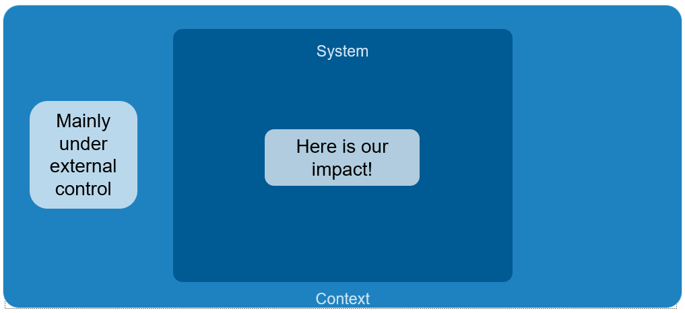
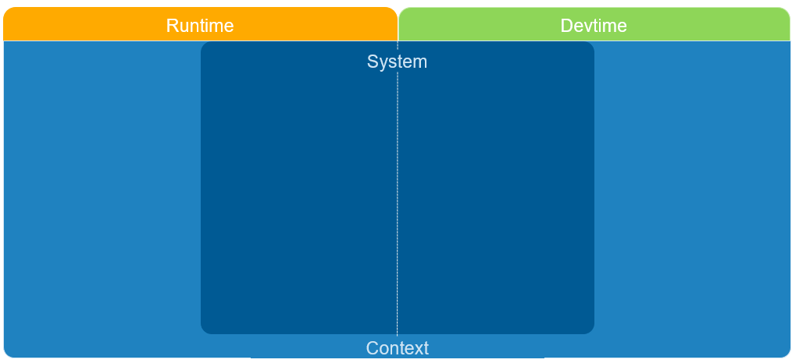
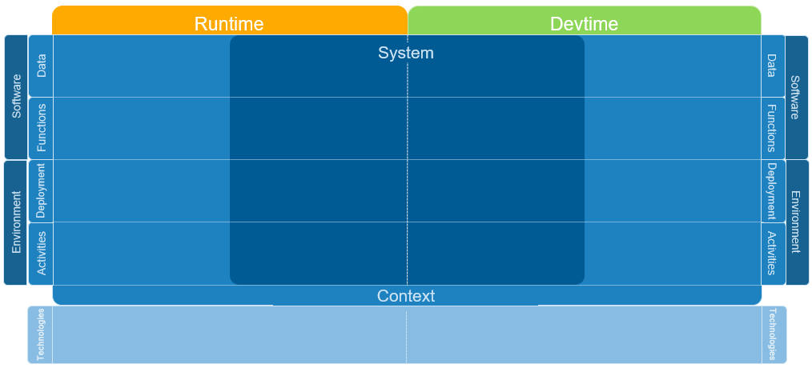
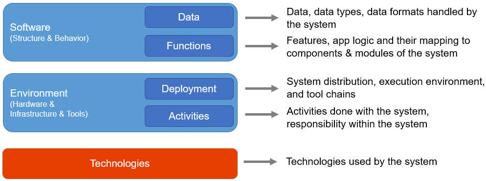
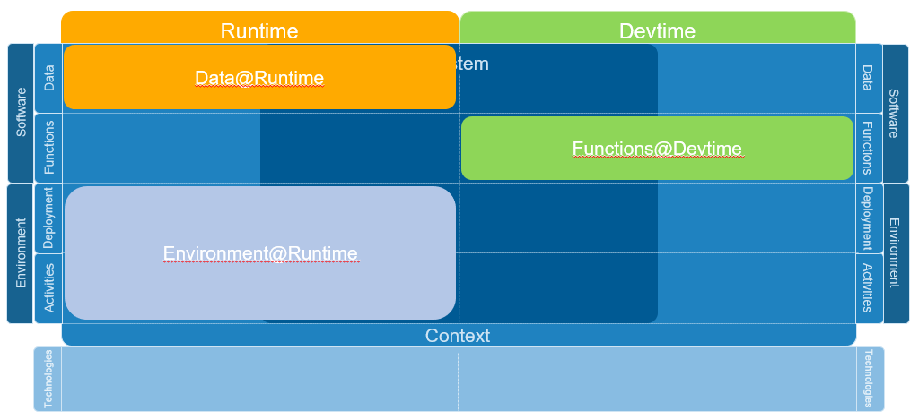

# Dimensions and view types reference (Architecture Decomposition Framework) <!-- omit in toc -->

## Introduction

While it is tempting to describe a software system in its full detail within one big diagram (and people try and fail doing so again and again), a much more feasible approach is to describe a system from different views. As the name *decomposition* framework suggests, we break down the system as a whole into manageable chunks. There are three different criteria we use to decompose a system. We call these criteria *dimensions*:

- Dimension 1: *System* versus *Context*
- Dimension 2: *Runtime* versus *Devtime* (development time)
- Dimension 3: *Data*, *Functions*, *Deployment*, *Activities*, *Technologies*

In the following sections, these are explained in further detail. Since this document is rather abstract and generic, it might help to have a look at some examples, as the figures used in [this documentation](https://github.com/neshanjo/what2eat/blob/with-cache/doc/architecture-documentation.md) or the pictures at the end of [this article](https://www.iese.fraunhofer.de/blog/softwarearchitekturen-einfacher-designen-und-verstaendlicher-dokumentieren-mit-dem-fraunhofer-adf/).

## Content <!-- omit in toc -->

- [Introduction](#introduction)
- [System versus Context](#system-versus-context)
- [Runtime versus Devtime](#runtime-versus-devtime)
- [Data, Functions, Deployment, Activities, Technologies](#data-functions-deployment-activities-technologies)
  - [Terminology](#terminology)
  - [Typical concerns of the different view types](#typical-concerns-of-the-different-view-types)
    - [Data@Runtime](#dataruntime)
    - [Data@Devtime](#datadevtime)
    - [Function@Runtime](#functionruntime)
    - [Function@Devtime](#functiondevtime)
    - [Data+Functions@Runtime](#datafunctionsruntime)
    - [Deployment@Runtime](#deploymentruntime)
    - [Deployment@Devtime](#deploymentdevtime)
    - [Activities@Runtime](#activitiesruntime)
    - [Activities@Devtime](#activitiesdevtime)
    - [Technologies@Runtime](#technologiesruntime)
    - [Technologies@Devtime](#technologiesdevtime)
- [Notation and typical elements for each view type](#notation-and-typical-elements-for-each-view-type)
- [Footnote](#footnote)

## System versus Context

A system is always embedded in a context, and we have to take that context into account when designing: There are the users of the system and there are other (external) systems that interact with our system.

The process of separating system from context is known as *system-context delineation*.

A simple rule of thumb that helps to decide what system belongs to what "side" is whether you have control over the system of system part, i.e. you can control its design, e.g. its API, or if you have to take the system as given.

## Runtime versus Devtime

When we want to visualize a system or parts of it, we always have to ask ourselves whether we are visualizing the running system (*Runtime*) or the system at the time of development (*Devtime*).

As crucial this distinction may seem, diagrams often mix these aspects, which, in practice, often leads to ambiguity and misunderstandings.

But is there a difference at all? Not always. E.g. there might be exactly one instance of the UserLogin component that is realized by exactly one UserLogin module containing one source code file with the respective implementation.

But very often there is a difference: A microservice is instantiated several times at runtime (several boxes), but of course developed in one same code base (one package). Or the one UserLogin component at runtime consists of modules UserLoginService, AbstractLoginService and additional third-party libraries for dealing with OAuth2 at devtime.

Thus, in runtime views, we describe the system as it behaves during execution (system in action). As elements we use components, layers, clusters/verticals, data, interfaces or connectors, thus logical elements, which structure a running system and describe the interaction. In design, we usually also start with such views, because we it is very helpful to first think about how the system should work when running, because that's what it's built for.

In contrast, with devtime views we think about how we want to realize the system (system in development, development team in action). Here we work primarily with modules, packages, data types, interfaces or libraries, i.e. logical elements that have to be developed and whose code and dependencies have to be organized.

If you have already created architecture views yourself (no matter which view framework or element types you have used), ask yourself if your diagram mixes runtime and devtime aspects and if if might be beneficial to transform it into two different diagrams. Very often this is possible and helpful.

## Data, Functions, Deployment, Activities, Technologies

Finally, we lay different aspects of systems across the previous dimensions of the ADF: Data, functions, deployment, activities, and technologies. This completes our framework, as the following illustration shows:

The following figure gives a rough overview of what the individual dimensions stand for:

### Terminology

Using the schema "Data/Functions/Deployment/Activities/Technologies"@"Runtime/Devtime", we can unambiguously indicate which aspect of the system we describe.

Hence, a diagram with the type "Data@Runtime" describes aspects of how data at runtime looks like and how many objects there are.

Note that mixed types like Functions+Deployment@Runtime are possible as well. Even Functions@Runtime+Devtime might be appropriate in one of the rare cases where we explicitly want to mix runtime and devtime aspects.

We recommend to append the type of each diagram to its title, like

- "System-Context delineation (Functions@Runtime)",
- "Main services (Functions@Runtime)",
- "Service class inheritance hierarchy (Data@Devtime)", or
- "Staging server deployment process (Activity+Deployment@Devtime)".

This way, anybody familiar with the ADF can classify more quickly what to expect.

If you have already created architecture views yourself (no matter which view framework or element types you have used), try to classify them with the above terminology.

### Typical concerns of the different view types

There are typical questions, that each view type usually is concerned with. We list them in the following subsections.

#### Data@Runtime

- Which actual data is used at runtime?
  - e.g. data about a user, data about a delivery
- Which objects are created? How many?

#### Data@Devtime

- How are data structures defined?
- Which classes, interfaces, enums are there?
- How do the relate (e.g. inheritance, association)?
- What data formats are needed?

#### Function@Runtime

- What does the system do and what do the systems in the context do?
- How do I decompose the functionality in executable components?

#### Function@Devtime

- How is the software partitioned in the development environment?
- What are units at development time that should be compiled and tested separately?
- How can modules be divided so redundant code can be prevented?
- How can modules be decoupled?

#### Data+Functions@Runtime

It often makes sense to describe aspects for both data and functions at runtime in one view:

- What are functions and data at the interface to external systems?
- How should the components communicate and what interfaces should they use/provide?
- Where is the data created, transported, processed and stored within the system?

#### Deployment@Runtime

- How is the software being executed? On which servers, (virtual) machines, containers?
- Which are the different "running parts" of the software? I.e. what processes/tasks do exist during runtime? Where are they allocated and executed?
- How do the "running parts" communicate with each other?
- What execution environments do I need? (e.g. Application Server, Linux server)
- How to partition the software into parallel tasks?

#### Deployment@Devtime

- How do runtime components (allocated to processes/tasks) map to development units?
- How are the compilation units mapped to deployable artifacts?
- How are deployment units created?
- How does the tool chain look like for building and deploying the software to the final execution environment?

#### Activities@Runtime

- How does operation of the system look like?
- Who operates the software in what location?
- How are system updates performed?
- How are issues in the production system detected, reported, and handled?

#### Activities@Devtime

- Who is involved in the development and delivery of the software system?
- Who is responsible for what system portions?
- How are modules mapped to teams?
- How is the development, quality assurance and delivery of the software organized in terms of processes and organizational units?
- How to assign the modules to development iterations?

#### Technologies@Runtime

- What technologies are used at runtime?
- What technologies are used for communication between the system and external systems?
- What are properties of candidate technologies (bandwidth, latency, throughput, processing power, energy consumption, etc.)

#### Technologies@Devtime

- What tools are being used for development and delivery?
- How are the tools connected/integrated?

## Notation and typical elements for each view type

It is left to everybody's own choice which notation to use for the different view types. In practice, however, it makes sense to choose a notation based on UML, because this is familiar to many software engineers and offers suitable notation elements for all elements of the ADF.

A list of typical elements and relations for each view type can be found in the [ADF Reference: ADF elements per view type](../adf-elements/ADF-elements.md).

## Footnote

This summary was compiled by Johannes Schneider. You can use all material freely under the [CC BY-SA 4.0 license](https://creativecommons.org/licenses/by-sa/4.0/).
