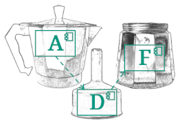

# Documentation-as-code (Architecture Decomposition Framework) <!-- omit in toc -->



## Content <!-- omit in toc -->

- [What is documentation-as-code?](#what-is-documentation-as-code)
- [Why documentation-as-code?](#why-documentation-as-code)
- [Documentation-as-code, generic implementation](#documentation-as-code-generic-implementation)
- [Documentation-as-code, the ADF realization](#documentation-as-code-the-adf-realization)
  - [Step 1 and Step 3](#step-1-and-step-3)
  - [Step 2](#step-2)
  - [Example](#example)
  - [ADF tool libraries within VS Code](#adf-tool-libraries-within-vs-code)
  - [Generate PDF documents from Markdown](#generate-pdf-documents-from-markdown)
- [Presentation-as-code](#presentation-as-code)
- [Footnote](#footnote)

## What is documentation-as-code?

*Documentation-as-code* means to

1. put your documentation (usually, the architecture documentation) as close as possible to the source code and make sure that it is under version control,
2. choose a format that any developer can edit with low effort, and
3. make up-to-date documentation accessible to everyone (including non-tech-people) in an easily consumable format.

## Why documentation-as-code?

Most developers prefer implementing new features over documenting their architecture. If they are additionally forced to leave their familiar development environment to deal with stubborn Word templates and documents on VPN-protected network drives, the chances of the documentation matching the current state of development are relatively slim. To have an up-to-date, easily accessible documentation, we need something else than this.

## Documentation-as-code, generic implementation

Usually, the three points from above are addressed in this way.

Step 1: Just create a folder for the documentation in the project repository (e.g. Git repository) which also contains the corresponding source code. If you have multiple repositories for different parts of the software and need to document more than one part at once, an extra repository can be necessary - but be aware that this creates an additional indirection (a mono-repo approach can help here).

Step 2: Choose a plaintext format (with mark up possibilities) like Markdown, AsciiDoc, LaTeX or HTML. Decide which format to use for graphics. Options include vector graphics formats with IDE plugin support like Diagrams.net/Draw.io or Diagram-from-plaintext formats like PlantUML.

Step 3: With every commit, generate a human-friendly rich-text version of the documentation. This can be as simple as the Git server rendering an HTML page from Markdown or Asciidoc, or a more sophisticated process run by the build server that runs LaTeX and publishes PDFs to a shared file system.

## Documentation-as-code, the ADF realization

In this section, we describe our choice of tools and technologies to realize Steps 1 to 3. There are many other possibilities available with more flexible and advanced functions, but we choose one of the most simple solution on purpose, in order to to keep the entry barrier as low as possible.

This tool chain has been successfully used in different student projects even with unexperienced developers after not more than 60 minutes of introduction.

### Step 1 and Step 3

We assume that the source code is in one repository on a Git server that supports Markdown-to-HTML rendering, e.g. GitHub or GitLab. We just create a folder `documentation` with an file `architecture-documentation.md` and the content

```markdown
# Architecture documentation

Hello World!
```

Alternatively, we directly use the [ADF architecture documentation template](https://github.com/architecture-decomposition-framework/adf-documentation-template).

As soon as we commit the changes and push to the server, we get an HTML page with the rendered documentation and can easily distribute it via the link to the repository. Even non-devs can be given roles with limited access (as the Reporter role in GitLab) such that they can browse the documentation.

This also works well with different (feature) branches with a (preliminary) updated version of the docs that can be reviewed by other people.

### Step 2

As the previous section already suggests, we use [Markdown](https://en.wikipedia.org/wiki/Markdown) as plaintext format. We do so since it is the simplest format for generating rich text documents and is widely used in other context (e.g. wikis). There is also a good tool support - almost every IDE supports syntax highlighting and some autocompletion and autoformat functions.

As for diagrams, we use [Diagrams.net (formerly known as draw.io)](https://www.diagrams.net/) since it can save diagrams as SVG and PNG files with the diagram itself embedded. Thus, we can open the SVG (or PNG) file, edit the diagram and it updated the SVG (or PNG) as well as the embedded diagram. Consequently, there is no need of an additional "generate SVG (or PNG) file" step - we can immediately embed the SVG (or PNG) into the markdown file.

> *Diagrams-as-Code*: To go even one step further, we can generate diagrams from code, too. There are even [predefined ADF elements for PlantUML](https://github.com/architecture-decomposition-framework/adf-plantuml) (see how this can look in the [example documentation with PlantUML diagrams](https://github.com/neshanjo/what2eat/blob/with-cache/doc-plantuml/architecture-documentation-plantuml.md)). The [VS Code PlantUML extension](https://marketplace.visualstudio.com/items?itemName=jebbs.plantuml) is highly recommended.

Diagrams.net runs without installation in any web browser and can be installed as desktop application, however, we recommend to use one of the (unofficial) IDE plugins to be able to edit the diagrams without leaving the IDE.

If the developers are not already using [Visual Studio Code](https://code.visualstudio.com/) and it is feasible for them to (also) use this IDE, we recommend to use it for Markdown editing, because there are some excellent plugins that facilitate the editing a lot:

- [Markdown All in One](https://marketplace.visualstudio.com/items?itemName=yzhang.markdown-all-in-one) lets you autogenerate section numbers and content tables, both features that Markdown unfortunately does not support itself
- [markdownlint](https://marketplace.visualstudio.com/items?itemName=DavidAnson.vscode-markdownlint) makes sure that your documents follow a typical style (like blank lines before and after headings, etc.)
- [Draw.io integration](https://marketplace.visualstudio.com/items?itemName=hediet.vscode-drawio) lets you edit your diagrams directly in the IDE. To add a new one, just create a new file *somename*.drawio.svg (or *somename*.drawio.png) and open it with the plugin. It will always update the generated SVG (or PNG) with your diagram.
- [Code Spell Checker](https://marketplace.visualstudio.com/items?itemName=streetsidesoftware.code-spell-checker) helps you with the spelling (optionally install support for other languages as well)
- [Marp for VS Code](https://marketplace.visualstudio.com/items?itemName=marp-team.marp-vscode) integrates Marp into VS Code and let's you create simple but effective presentations from nothing more than Markdown. Hence, you can easily copy and paste from your documentation to a presentation.

### Example

[This example documentation](https://github.com/neshanjo/what2eat/blob/with-cache/doc/architecture-documentation.md) is written in Markdown and directly embeds figures made with Diagrams.net.

### ADF tool libraries within VS Code

See [Use the ADF tool libraries for diagrams.net with the VS Code plugin](./VS-Code-ADF-Diagrams-net.md).

### Generate PDF documents from Markdown

See [Generate PDF from Markdown](./Generate-pdf-from-markdown.md)

## Presentation-as-code

Thanks to [Marp](https://marp.app/), the Markdown Presentation Ecosystem, simple and effective presentations can be easily generated by reusing Markdown code and figures from the documentation.

The What2Eat example project also contains a [Marp example](https://raw.githubusercontent.com/neshanjo/what2eat/with-cache/doc/architecture-presentation.md) that illustrates some of the features in Marp. Note that the [version rendered by GitHub](https://github.com/neshanjo/what2eat/blob/with-cache/doc/architecture-presentation.md) is *not* the resulting presentation. The final presentation is demoed in [this PDF file](https://raw.githubusercontent.com/neshanjo/what2eat/with-cache/doc/architecture-presentation.pdf).

## Footnote

This document was written by Johannes Schneider. You can use all material freely under the [CC BY-SA 4.0 license](https://creativecommons.org/licenses/by-sa/4.0/).
