# Elements and relations reference (Architecture Decomposition Framework)

Version 1.1.0

- [Elements and relations reference (Architecture Decomposition Framework)](#elements-and-relations-reference-architecture-decomposition-framework)
  - [Overview](#overview)
  - [Software@Runtime](#softwareruntime)
  - [Software@Devtime](#softwaredevtime)
  - [Environment@Runtime](#environmentruntime)
  - [Environment@Devtime](#environmentdevtime)
  - [Custom elements and relations](#custom-elements-and-relations)
  - [Footnote](#footnote)

## Overview

This figure shows all elements in overview:

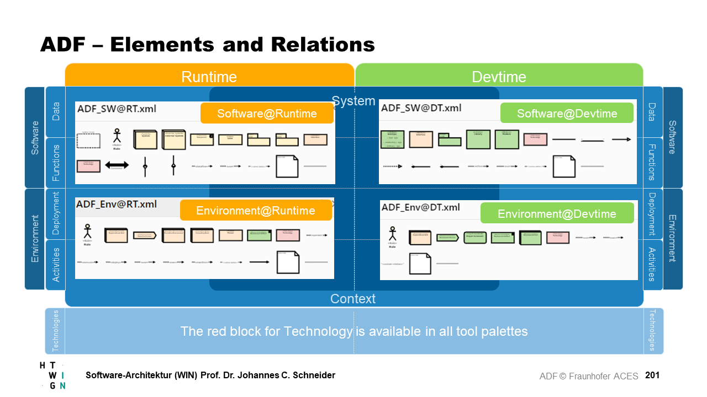

## Software@Runtime

Software = Data and Functions, thus, these elements can be used in views of the types Data@Runtime and Functions@Runtime.

| Element | Description |
| ------- | ----------- |
| 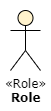 | A role represents the interests of a specific group of stakeholders. |
| 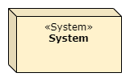 | The system under study. This is the highest level representation and decomposed in the architecture. |
| 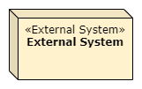 | An external system is a system that is in the context of the system under study but can only be partially influenced. External systems send or receive data. |
| 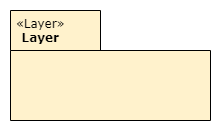 | A layer is a logical (horizontal) container for components. It enables to define common access rules for all components contained in the layer. Layers are typically ordered and thus define the direction and hierarchy of accesses. |
| 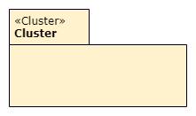 |  A cluster is a logical (vertical) container for components. It enables to define common access rules for all components contained in the cluster.  |
| 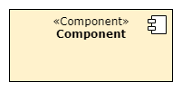 | A component is a functional self-contained runtime entity handling a concern of a software system. A component can be composed of other components. Components provide and require interfaces to communicate with other components. |
| 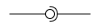 | Interface connectors can be used with systems or components. Left side (lollypop) provides interface, right side requires interface. An interface connector at runtime can be realized by an [interface element at devtime](#softwaredevtime) which typically uses the same name. |
|  | Interfaces elements are used as entities for defining clear component boundaries. Each interface is centered about a specific role that a component has. While for most use cases, the interface connector element (see above) provides enough details, this interface element can provide more specific information about certain interface endpoints or methods, and it can be connected to multiple components to express that they provide or require the same interface. An interface connector at runtime can be realized by an [interface element at devtime](#softwaredevtime) which typically uses the same name. |
| 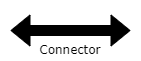 | A connector allows components to communicate with other components that are connected by it. A connector can be used as an abstraction of complex interaction mechanisms. It can be hierarchically composed of further components and connectors realizing the communication. |
| 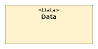 | To express the exchange of information at runtime between components, via connectors or in and out of the system data entities are used. They adhere to their corresponding data type. |
| 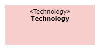 | A technology represents the usage of third party solutions, packaged as a technology, e.g. in form of a library or tool. |
| 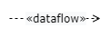 | Dataflow indicates that data flows from one element to the other |
|  | Usage indicates that one element uses another element. Thus, it depends on the other element. |
| 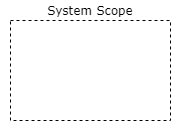 | Can drawn around several systems or components to indicate that these form the system scope (as opposed to everything else that is the system context). |
| 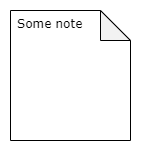 | Note elements are used to give further information or explanation in a diagram. |
| 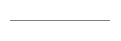 | Connects note elements to certain diagram elements or relations in order to annotate them. |

## Software@Devtime

Software = Data and Functions, thus these elements can be used in views of the types Data@Devtime and Functions@Devtime.

| Element | Description |
| ------- | ----------- |
| 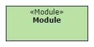 | A module is a development time entity created with the help of development tools that realizes one or more components. |
|  | Interfaces are used as entities for defining clear module boundaries. They can be used to abstract from modules that provide a common functionality with different implementations or to realize an [interface connector or interface element at runtime](#softwareruntime) which then typically uses the same name. |
| 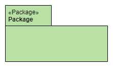 | A package is a physical container for modules and helps to organize them. |
| 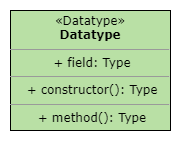 | A data type defines how data entities of a specific type are structured, what attributes they contain and how they are related to each other. |
| 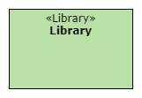 | A library enables a system to use specific technology that is packaged in a library. |
|  | A technology represents the usage of third party solutions, packaged as a technology, e.g. in form of a library or tool. |
| 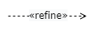 | Refinement is a relationship that represents a fuller specification of something that has already been specified at a certain level of detail. For example, a design class is a refinement of an analysis class. |
| 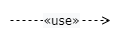 | Usage indicates that an elements requires another element for full implementation or operation, e.g. usage of a technology or a library. |
| 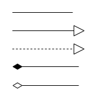 | Association, Generalization, Realization, Composition and Aggregation are used as in UML class diagrams (see standard literature on this topic). |
|  | Note elements are used to give further information or explanation in a diagram. |
|  | Connects note elements to certain diagram elements or relations in order to annotate them. |

## Environment@Runtime

Environment = Deployment and Activities, thus these elements can be used in views of the types Deployment@Runtime and Activities@Runtime.

| Element | Description |
| ------- | ----------- |
| 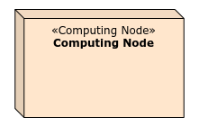 | A computing node represents a (virtual or real) machine. This node is used to execute a deployment artifact or an execution environment. |
| 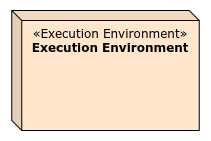 | An execution environment runs on a computing node and is capable of executing a deployment artifact. E.g. Browser, Application Server, Docker. |
| 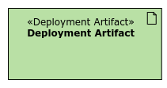 | A deployment artifact is a development and operation time entity that can be deployed to a computing node or an execution environment. |
| 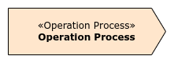 |  The operation process describes how specific roles operate computing nodes and execution environments in order to execute deployment artifacts. |
|  | A technology represents the usage of third party solutions, packaged as a technology, e.g. in form of a library or tool. |
| 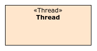 | Besides the pure behavior of components in terms of message exchanges, concurrency aspects might be important. Thus, threads of concurrent execution can be expressed and the communication among threads and the assigned components can be sketched. |
|  | A role represents the interests of a specific group of stakeholders. |
|  | An organizational unit reflects the organizational structure of involved parties. It helps to structure roles. |
| 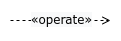 | Operation:  Computing nodes and execution environments are operated by roles or operation processes. |
| 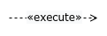 | Execution: Execution environments execute components (from Software@Runtime views) |
| 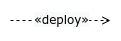 | Deployment: Deployment artifacts deploy to computing nodes or execution environments. |
|  | Ownership: Roles can own computing nodes and operation processes. |
| 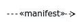 | Manifestation: Deployment artifacts manifest components (from Software@Runtime) |
| 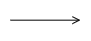 | A communication path can be used to model communication paths between computing nodes. |
|  | Note elements are used to give further information or explanation in a diagram. |
|  | Connects note elements to certain diagram elements or relations in order to annotate them. |

Further custom relations can be expressed (see section "Custom Elements and Relations"), e.g.

- a role *belongs to* an organizational unit, or
- a role *follows* an operation process.

## Environment@Devtime

Environment = Deployment and Activities, thus these elements can be used in views of the types Deployment@Runtime and Activities@Runtime.

| Element | Description |
| ------- | ----------- |
|  | A role represents the interests of a specific group of stakeholders. |
| 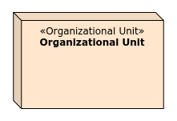 | An organizational unit reflects the organizational structure of involved parties. It helps to structure roles. |
| 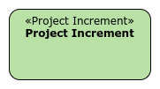 | A project increment realizes parts of the system or the final system in terms of modules. |
|  | A deployment artifact is a development and operation time entity that can be deployed to a computing node or an execution environment. |
| 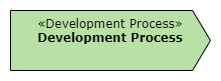 | The development process describes how specific roles work together in order to develop a project increment. |
| 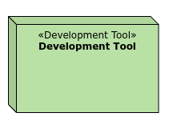 | A development tool is used during the development process to create modules as an artifact that adheres to a specific technology. |
|  | A technology represents the usage of third party solutions, packaged as a technology, e.g. in form of a library or tool. |
|  | Manifestation: Deployment Artifacts manifest Modules (from Software@Devtime) |
|  | Role can use development tools. |
| 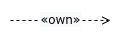 | Roles can own development processes. |
|  | Note elements are used to give further information or explanation in a diagram. |
|  | Connects note elements to certain diagram elements or relations in order to annotate them. |

Further custom relations can be expressed (see section "Custom Elements and Relations"), e.g.

- a development process *creates* a project increment, or
- a role *belongs to* an organizational unit.

## Custom elements and relations

Custom elements can be defined whenever the predefined elements are not sufficient to explain the architecture.

| Element | Description |
| ------- | ----------- |
| 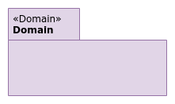 | Example for a custom element *Domain*. Reuses the cluster element, but as an own type Domain. Its meaning needs to be defined in the context of the architecture documentation. |
|  | Example for custom relation *initiates*. Its meaning needs to be defined in the context of the architecture documentation. |

## Footnote

This summary was compiled by Johannes Schneider. You can use all material freely under the [CC BY-SA 4.0 license](https://creativecommons.org/licenses/by-sa/4.0/).
