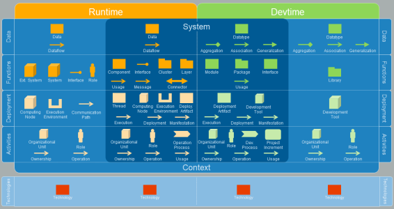
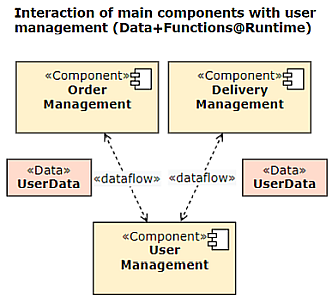
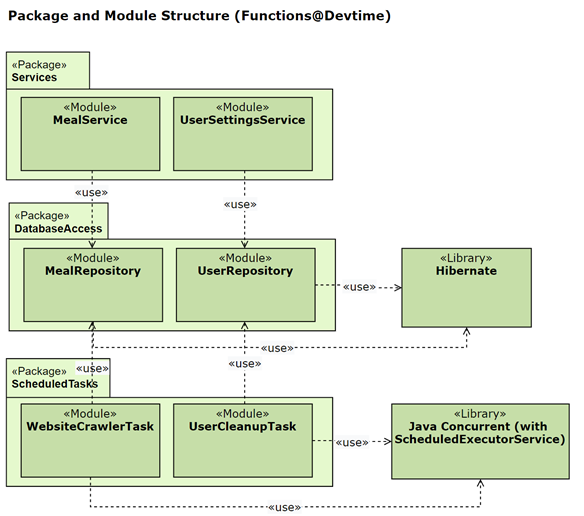

# FAQs (Architecture Decomposition Framework) <!-- omit in toc -->

## Content <!-- omit in toc -->

- [What is the Architecture Decomposition Framework (ADF)?](#what-is-the-architecture-decomposition-framework-adf)
- [Who is using the ADF?](#who-is-using-the-adf)
- [Why do we need to decompose a software system into smaller parts?](#why-do-we-need-to-decompose-a-software-system-into-smaller-parts)
- [ADF in a nutshell: What are the different views on a system?](#adf-in-a-nutshell-what-are-the-different-views-on-a-system)
- [How can I learn more?](#how-can-i-learn-more)
- [Which tools do I need to use the ADF?](#which-tools-do-i-need-to-use-the-adf)
- [How can I write a full architecture documentation using the ADF?](#how-can-i-write-a-full-architecture-documentation-using-the-adf)
- [What about other view frameworks?](#what-about-other-view-frameworks)
- [Footnote](#footnote)

## What is the Architecture Decomposition Framework (ADF)?

The Architecture Decomposition Framework (ADF) is a **view framework** that makes central aspects of **software architecture** more explicit by naming the view types with intuitive and speaking names. It is **suitable for all software systems** and **can be used freely** by everyone. The ADF makes **designing**, **documenting**, and **understanding** architectures significantly easier.

## Who is using the ADF?

The ADF has been used in many industry and research projects from all different domains. It originates from the [Fraunhofer IESE institute](https://www.iese.fraunhofer.de/) and is taught at [Fraunhofer Academy](https://www.academy.fraunhofer.de/de/weiterbildung/information-kommunikation/softwarearchitektur.html), [HTWG Konstanz](https://www.htwg-konstanz.de/hochschule/fakultaeten/informatik/uebersicht/) and [hochschule mannheim](https://www.informatik.hs-mannheim.de/), the latter being universities of applied science.

## Why do we need to decompose a software system into smaller parts?

We use to breakdown complex matters into manageable chunks all the time. To understand how the human body works, a medical student uses many different figures illustrating the skeleton, the muscle apparatus, the vascular system, ... - and even different diagrams for different body parts. The house building architect makes a site plan as an overview, floor plans for each story, different perspectives of outer walls and the roof construction and dedicated diagrams showing power lines and outlets. So what about software?

> “It is not possible to capture the functional features and quality properties of a complex system in a single comprehensible model that is understandable by and of value to all stakeholders.” [Rozanski, Woods, 2005]

 While it is tempting to describe a software system in its full detail within one big diagram (and people try and fail doing so again and again), a much more feasible approach is to describe a system from different views.

## ADF in a nutshell: What are the different views on a system?

We start by defining, what our system is, i.e. which part of the software is under our (the architect's) control. This process is known as *system-context delineation*.

Then we ask ourselves if we are about to describe properties of the running system (*runtime*) or of the system under development (development time, short *devtime*). This aspect is often neglected in other view frameworks, which can lead to confusion when both runtime and devtime is pictured in the same figure. To give an example: A component at runtime can be instantiated twice, but can be realized from one source code file (plus some additional libraries) - hence, we have two different structures at runtime and devtime.

Finally, there are different aspects of the system to describe which we call *dimensions*:

- Data
- Functions
- Deployment
- Activities
- Technologies

An overview can be found in the following figure (click to enlarge):

Here are two unrelated examples for different view types, modelled with draw.io:

Note the consequent naming scheme: "Name of view" ("Type of view").

## How can I learn more?

Have a look at the other linked resources on our [ADF welcome page](../README.md). Reading the blog article or look at some example is a good next step.

## Which tools do I need to use the ADF?

Short answer: Mostly your brain (and some experience in software architecture).

The ADF is not dependent on certain tools. Thus, you can use it with the basic elements and relations shown in the [summary picture](assets/ADF_summary.png) above on whiteboards or simple drawing tools (even PowerPoint). However, tools with support for dedicated UML elements and relations are recommended as soon as there is a need for a more formal, consistent and better readable documentation.

Currently, there is support in Enterprise Architect (see [this page](https://www.iese.fraunhofer.de/de/leistungen/software-architektur/architekturkonstruktion/aces-technologies.html) for more information).

For an easy start, however, **we recommend using diagrams.net (formerly known as draw.io)**. For all ADF elements [as described here](../adf-elements/ADF-elements.md), there are [custom tool libraries](https://github.com/architecture-decomposition-framework/adf-diagramsnet). You can immediately start using them in the browser - its only one click from [here](https://github.com/architecture-decomposition-framework/adf-diagramsnet).

## How can I write a full architecture documentation using the ADF?

Use our [architecture documentation template](https://github.com/architecture-decomposition-framework/adf-documentation-template)!

It's written in Markdown and even more lightweight than other templates in AsciiDoc while it can be easily converted to other formats.

## What about other view frameworks?

There are many other architecture view frameworks as arc42, Kruchten 4+1, SEI view types and Siemens 4 Views, just to name some. If you are using one of these, that's great because, first, you are doing architecture work at all and, second, you use a consistent and uniform language on your views.

Consider studying the ADF anyway for one of the following reasons:

- our explicit type system along the dimensions runtime/devtime and data/functions/deployment/activities makes it very clear, which aspect of the system you are describing. It also helps, not to mix up to many different aspects of a system. Why not try to define two different building block views (arc42) for runtime and devtime aspects?
- Our [architecture documentation template](https://github.com/architecture-decomposition-framework/adf-documentation-template) is not specific for a certain view framework. Use it and adapt it for your needs.
- [Our toolchain](../adf-doc-as-code/Doc-as-code.md) (markdown with embedded .drawio.svg figures) is an alternative [docs-as-code](https://docs-as-co.de/) approach. We think that using Markdown lowers the hurdle of writing documentation even more.

## Footnote

This article was written by Johannes Schneider. You can use all material freely under the [CC BY-SA 4.0 license](https://creativecommons.org/licenses/by-sa/4.0/).
